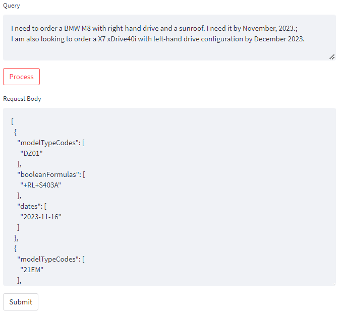

# BMW Challenge: Query to Boolean Conversion

### Description: 
The application takes in queries from users in a natural language format and converts them into a request body with a boolean code. The program has been written in Python 3.9 and the following are the main libraries used:
- Spacy
- TextBlob
- Streamlit
- DateFinder

### Basic Functionality:
- The boolean codes are only formed with `+`, `+-`, `/`,`/-` symbols. 
- The algorithm can recognize multiple model codes or can split them into multiple codes if there is any ambiguity.
- It can account for minor spelling or typographical errors because of the lcs algorithm.
- The following shows an example of generated request body from a query
<b> Query: </b>
```
I want to order a BMW xDrive with a panaroma glass roof or a sunroof along with a right-hand drive config.Please do not add the M Sport Package or the M Sport Package Pro. Is a delivery on 13th of December possible?
```
<b> Request Body: </b>
```json
[
  {
    "modelTypeCodes": ["21CF"],
    "booleanFormulas": ["+(S402A/S403A)+RL+-(P337A/P33BA)"],
    "dates": ["2023-12-13"]
  },
  {
    "modelTypeCodes": ["11CF"],
    "booleanFormulas": ["+(S402A/S403A)+RL+-(P337A/P33BA)"],
    "dates": ["2023-12-13"]
  },
  {
    "modelTypeCodes": ["21EM"],
    "booleanFormulas": ["+(S402A/S403A)+RL+-(P337A/P33BA)"],
    "dates": ["2023-12-13"]
  },
  {
    "modelTypeCodes": ["21EN"],
    "booleanFormulas": ["+(S402A/S403A)+RL+-(P337A/P33BA)"],
    "dates": ["2023-12-13"]
  }
]
```

### User Interface Walkthrough:
The main page has a text area for query. After typing in the query, you can hit the process button to claculate the request body. Before submitting the body, you can edit it in the next text area. 
<p align="center">
  
</p>

Other information about the UI:
- The reference table can be accessed from the dropdown in window on the left.
- You can add multiple prompts by seperating them with ';'. All the request bodies will be put into one list.
<p align="center">
  
</p>
- An error will be raised if the algorithm cannot find the model code or the date. Also, dates that are before the present date would not be accepted.
<p align="center">
  
</p>

### Description of the Code:

- <b> Utilities/utilities.py </b> : This contains basic functions to compare text. The main function used from this is the lcs_similaity that calculates the longest common subsequence similarity between two texts. (There are also some experimental functions using BERT to compare texts but they haven't been utilized).
- <b> Utilities/pos_tagging.py </b> : These contains functions to find the key elements such and their features and accumulate them in form of tags. These are tags are then used to find the model code and the boolean logic. 
- <b> Utilities/request_body_creation.py </b> : These are the main functions used for creating the request body. It contains methods to segregate tags into the 4 given categories, get the connotation of a tag, find the boolean logic and the model type and combine them into the request body format.
- <b> Method_test.py </b>: It contains code to test the basic functions and run the test cases from `test_cases.csv`. It also contains markdown text to show the process of building this application.
- <b> interface.py </b>: It contains the streamlit code for the user interface. 

### How to run the code:
- You can either install the requirements `pip install -r requirements.txt` or create a virtual environment from the `Env/environment.yml` file.
- Run the file `run.py` and the application will run on your local host. (Note: On running the code, the `en_core_web_md` model and the NLTK corpora will be downloaded if they are not available in the environment alreay).
- If there are any issues with the dependencies, the streamlit application is hosted on https://saint7579-bmw-test-interface-7cvopu.streamlit.app/.


### Issues and Missing Features:
- The finddate library cannot detect phrases like "End of December".
- In detecting the boolean logic, the article and capitalization play an important role (especially with the M Sport Package). In some cases, getting them incorrect can lead to wrong boolean logic or sometimes, missdetection in the model code. 
- The test cases have been generated with the help of LLMs and do not show much variation in their basic structure. A more diverse set would lead to a better evaluation. 
- It cannot deal with cases where different model types have different boolean requirements. For example "I am looking for a BMW M8 with a sunroof or a BMW 318i without a sunroof". In this case, 2 bodies are formed with the same boolean formula ` "+(S403A/-S403A)"`.
- Although POS Tagging and Spacy work good in this case, if the lookup table size increase, this solution might not hold. There are some hacky solutions used here to recognize terms like `iX` and `xDrive40` as these were not being tagged as NOUN or PROPN by spacy. Similarly, there are issues with recognizing 'm sports package' as a compound noun, however 'M Sports Package' work. Ideally, with enough data, this can be converted into a text segmentation problem (with some sort of self attention model) where the model can automatically label the terms without needing it's POS.  
